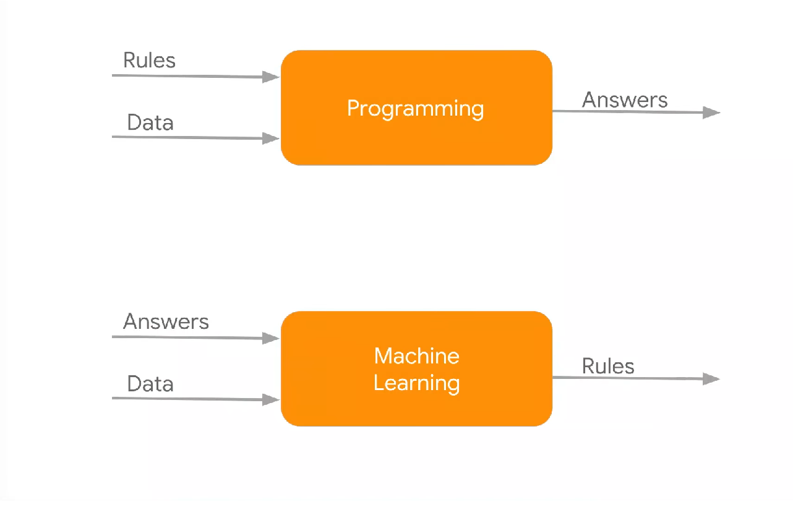
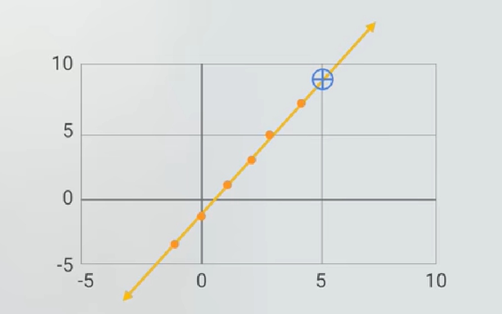

# Simple-Tensorflow
A simple Machine Learning (ML) example, which runs on browser with JavaScript

# What is Machine Learning (ML)?
ML is a category of algorithm that allows software applications to become more accurate in predicting outcomes without being explicitly programmed.

# Programming vs Machine Learning (ML)?
The main difference between the traditional programing and ML as shown below.



 In programing, you can feed in fixed Rules (explicitly program the logic) and Data to derive the Result. Whereas in ML, you feed-in sample training data (features) along with answers (label) to derive/determine the Rules/patterns. These Rules can be used to predict the outcomes for the provided input.

# What does this example do?
This is the simplest ML example to solve the `f(x)=y` use-case with the help of TensorFlow.js library. i.e; find the `value of y` by passing `input value x`


# How does it work?
Here are the high-level steps to make it work 

1) Identify model: Since this usecase is simple, you can use the out-of-box model. Otherwise, you can define your own model (classifer/function)
```javascript
const model = tf.sequential();
model.add(tf.layers.dense({units: 1, inputShape:[1]}));
```
2) Feed in the Training Data and answers into the model
```javascript
const xs=tf.tensor2d([-1,0,1,2,3,4],[6,1]);
const ys=tf.tensor2d([-3,-1,1,3,5,7],[6,1]);

await model.fit(xs, ys, {epochs: 500});
```
3) Predict the result for the given test data. 
```javascript
model.predict(tf.tensor2d([20],[1,1]));
```

# Vocabulary

Classifer: actual function or algorithem to predict the results
Rules: Actual model with all logic embeeded in it
Answers: Represented as `Lables` in TensorFlow
Data: Also know as Trained Data, is so called as features

Algorithems can be derived based on the fed features along with the corresponding lables.


